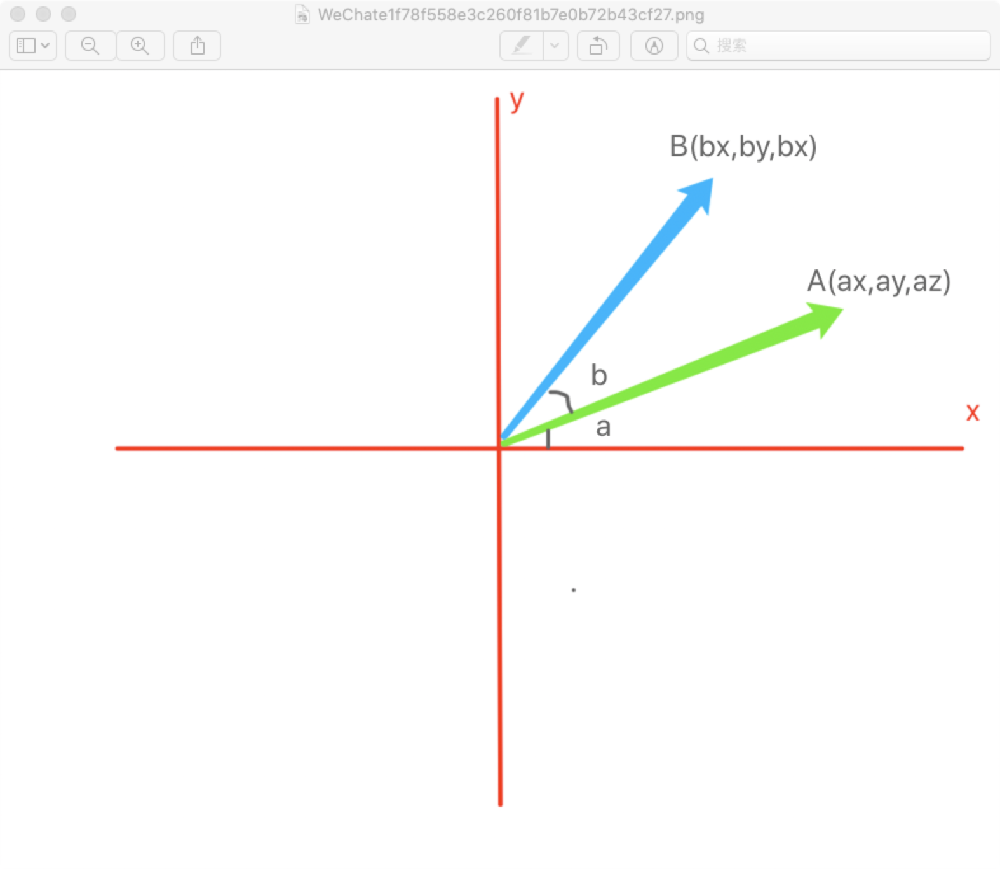
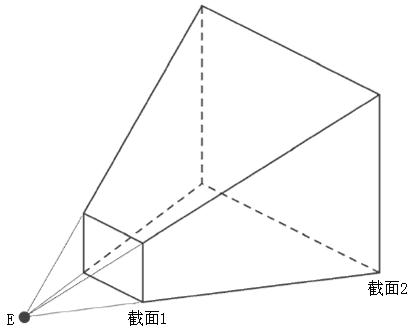
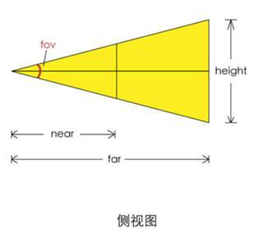

## WebGL中绕单轴旋转
在webGL中通过右手坐标系去思考其中的旋转
- 当物体绕z轴，从x轴正半轴向y轴负半轴逆时针旋转，为正向旋转，反之为负向旋转
- 当物体绕x轴，从y轴正半轴向z轴正半轴逆时针旋转，是正向旋转，反之为负向旋转
- 当物体绕y轴，从z轴正半轴向x轴正半轴逆时针旋转，是正向旋转，反之为负向旋转


 

### 思路过程
举例：计算一个顶点A绕z轴旋转后所在B的位置

1. 已知点A,以及∠B
2. ∠XOB = ∠a+∠b
3. bx=cos(∠XOB)*OA
4. by=sin(∠XOB)*OA
5. 利用三角形勾股定理求出OA的长度
   ```js
    const OA = Math.sqrt(ax*ax + ay*ay) //首先计算OA的长度
   ```
6. 利用三角形的和角公式得出
   ```js
   cos(∠XOB) = cos(∠a+∠b) = cos(a)*cos(b) - sin(a)*cos(b)
   sin(∠XOB) = sin(∠a+∠b) = cos(b)*sin(a) + sin(b)*cos(a)
   ```
7. 由此求出bx,by
   ```js
   bx=(cos(a)*cos(b) - sin(a)*sin(b))*OA
   by=(cos(b)*sin(a) + sin(b)*cos(a))*OA
   ```
8. 简化公示
   因为：ax = cos(a) * OA, ay = sin(a) * OA
   上式化简为:
   
   ```js
   bx = (cos(a)*cos(b))*OA - (sin(a)*sin(b))*OA
   by = (cos(b)*sin(a))*OA + (sin(b)*cos(a))*OA
   
   bx = ax*cos(b) - ay*sin(b)
   by = cos(b)*ay + sin(b)*ax
   
   bx = ax*cos(b) - ay*sin(b)
   by = ax*sin(b) + ay*cos(b)
   ```
9.  由向量和矩阵乘法计算
   ```js
   [x, y, z, w] 
      * 
   [
        a, b, c, d,
        e, f, g, h,
        i, j, k, l,
        m, n, o, p,
   ]
   	=
   [
       ax + by + cz + dw,
       ex + fy + gz + hw,
       ix + jy + kz + lw,
       mx + ny + oz + pw,
   ]
   得出
   [bx, by, bz, bw]
     = 
   [
       cos(b), -sin(b), 0, 0,
       sin(b),  cos(b), 0, 0,
       0,       0,      1, 0,
       0,       0,      0, 1
   ]
   	*
   [ax, ay, az, aw]
   	=
   [
     ax*cos(b) + ay*-sin(b) + az*0 + aw*0,
     ax*sin(b) + ay*cos(b) + az*0 + aw*0,
     ax*0 + ay*0 + az*1 + aw*0,
     ax*0 + ay*0 + az*0 + aw*1,
   ]
   	=
   [
     ax*cos(b) - ay*sin(b),
     ax*sin(b) + ay*cos(b),
     az,
     aw
   ]
   ```


```js
const OA = Math.sqrt(ax*ax + ay*ay) //首先计算OA的长度
// 通过三角函数得出bx，by
const [bx, by, bz, bw] 
= 
[
    cos(b)*ax - sin(b)*ay,
    sin(b)*ay + cos(b)*ax,
    1*az,
    1*aw
]
=
[ax, ay, az, aw]
*
[
    cos(b), -sin(b), 0, 0,
    sin(b),  cos(b), 0, 0,
    0,       0,      1, 0,
    0,       0,      0, 1
]
```

由以上推导计算点A绕z轴旋转后所在B的位置所需的矩阵为:
```js
[
    cos(b), -sin(b), 0, 0,
    sin(b),  cos(b), 0, 0,
    0,       0,      1, 0,
    0,       0,      0, 1
]
```
### 源码
以下为three.js中分别绕x、y、z轴旋转的源码
```js
    makeRotationX( theta ) {
		const c = Math.cos( theta ), s = Math.sin( theta );

		this.set(
			1, 0, 0, 0,
			0, c, - s, 0,
			0, s, c, 0,
			0, 0, 0, 1
		);
		return this;
	}

	makeRotationY( theta ) {
		const c = Math.cos( theta ), s = Math.sin( theta );

		this.set(
			 c, 0, s, 0,
			 0, 1, 0, 0,
			- s, 0, c, 0,
			 0, 0, 0, 1

		);
		return this;
	}
    makeRotationZ( theta ) {
		const c = Math.cos( theta ), s = Math.sin( theta );

		this.set(
			c, - s, 0, 0,
			s, c, 0, 0,
			0, 0, 1, 0,
			0, 0, 0, 1
		);
		return this;
	}
```

注意⚠️

通常在数学中矩阵是列主序，在webGL中矩阵是行主序的，以上都是用行主序的写法，其中的this.set()方法就是在将行主序的矩阵转换为列主序的矩阵

下面是set方法的源码

```js
set( n11, n12, n13, n14, n21, n22, n23, n24, n31, n32, n33, n34, n41, n42, n43, n44 ) {

		const te = this.elements;

		te[ 0 ] = n11; te[ 4 ] = n12; te[ 8 ] = n13; te[ 12 ] = n14;
		te[ 1 ] = n21; te[ 5 ] = n22; te[ 9 ] = n23; te[ 13 ] = n24;
		te[ 2 ] = n31; te[ 6 ] = n32; te[ 10 ] = n33; te[ 14 ] = n34;
		te[ 3 ] = n41; te[ 7 ] = n42; te[ 11 ] = n43; te[ 15 ] = n44;

		return this;

	}
```

## WebGL中lookAt

### 思路过程

其中的数学公式：

1. subVectors(eye, target) 向量eye减向量target
2. normalize()向量的归一化
3. crossVectors( up, z )向量的叉乘

### 源码

以下是three.js中Matrix4中lookAt的源码，主旨是让从eye视点位置看向target目标点位置

```js
const _x = new Vector3();
const _y = new Vector3();
const _z = new Vector3();	
lookAt( eye, target, up ) {
		const te = this.elements;
   	// _z是视点位置看向目标点的视线
		_z.subVectors( eye, target );
		if ( _z.lengthSq() === 0 ) {
			// 如果眼睛和目标在同一个位置的情况
			_z.z = 1;
		}

		_z.normalize();
		_x.crossVectors( up, _z );

		if ( _x.lengthSq() === 0 ) {
			// 如果上方向和视线z平行了
      // 稍微做一点偏移，不要让其处于平行的状态
			if ( Math.abs( up.z ) === 1 ) {
				_z.x += 0.0001;
			} else {
				_z.z += 0.0001;
			}
			_z.normalize();
			_x.crossVectors( up, _z );

		}

		_x.normalize();
		_y.crossVectors( _z, _x );

		te[ 0 ] = _x.x; te[ 4 ] = _y.x; te[ 8 ] = _z.x;
		te[ 1 ] = _x.y; te[ 5 ] = _y.y; te[ 9 ] = _z.y;
		te[ 2 ] = _x.z; te[ 6 ] = _y.z; te[ 10 ] = _z.z;

		return this;

}
```

## 正交投影矩阵

通过相机世界将现实世界投射到裁剪空间中的矩阵 --- 不同深度的物体不具备近大远小的透视规则。

### 思路过程

裁剪空间：裁剪空间是用于显示webgl图形的空间，以画布中心为原点，宽高深都为2的正方体盒子，当图像范围超过裁剪空间（大于1或小于-1）时，图像就会不显示了。

正交投影矩阵的建立需要(left, right, top, bottom, near, far)一个已知左右，上下，近裁剪面远裁剪面的矩形盒子。

正交投影就是将现实的世界投影到裁剪空间中

裁剪空间的总长度、宽度、深度都是2，现实世界是自己定义的，我们只需要按照一定的比例去缩放

**将现实世界投影到裁剪空间中的比例如下**
    裁剪空间中的right减去left（1 - （-1））比现实世界的 right减去left 可以计算出现实世界与裁剪空间的比值

   ```js
   const w = (1.0 - (-1.0)) / ( right - left ) = 2 / ( right - left )
   const h = (1.0 - (-1.0)) / ( top - bottom ) = 2 / ( top - bottom )
   const p = (1.0 - (-1.0)) / ( far - near ) = 2 / ( far - near )
   ```

**现实世界在裁剪空间中的位移量如下**
(裁剪空间中的位移量 加 裁剪空间中坐标原点(中心点)的值) 乘 此方向上的缩放比例

 ```js
 const x = (( right - left )/2 +left) * w
 const y = (( top - bottom )/2 +bottom) * h
 const z = (( far - near )/2 +near) * p

 ```

这样就可以得到投影矩阵了

```js
te[ 0 ] = w;	te[ 4 ] = 0;	te[ 8 ] = 0;	te[ 12 ] = - x;
te[ 1 ] = 0;	te[ 5 ] = h;	te[ 9 ] = 0;	te[ 13 ] = - y;
te[ 2 ] = 0;	te[ 6 ] = 0;	te[ 10 ] = -p;	te[ 14 ] = - z;
te[ 3 ] = 0;	te[ 7 ] = 0;	te[ 11 ] = 0;	te[ 15 ] = 1;
```

### 源码

```js
	makeOrthographic( left, right, top, bottom, near, far ) {

		const te = this.elements;
		const w = 1.0 / ( right - left );
		const h = 1.0 / ( top - bottom );
		const p = 1.0 / ( far - near );

		const x = ( right + left ) * w;
		const y = ( top + bottom ) * h;
		const z = ( far + near ) * p;

		te[ 0 ] = 2 * w;	te[ 4 ] = 0;	te[ 8 ] = 0;	te[ 12 ] = - x;
		te[ 1 ] = 0;	te[ 5 ] = 2 * h;	te[ 9 ] = 0;	te[ 13 ] = - y;
		te[ 2 ] = 0;	te[ 6 ] = 0;	te[ 10 ] = - 2 * p;	te[ 14 ] = - z;
		te[ 3 ] = 0;	te[ 7 ] = 0;	te[ 11 ] = 0;	te[ 15 ] = 1;

		return this;

	}
```


比较计算结果

```js
{
  const projectionMatrix = new Matrix4()
  projectionMatrix.makeOrthographic( -3, 3, 4, -4, -2, 2)
  console.log(projectionMatrix.elements);
  //[0.3333333333333333, 0, 0, 0, 0, 0.25, 0, 0, 0, 0, -0.5, 0, -0, -0, -0, 1]
}
{
  makeOrthographic(-3, 3, 4, -4, -2, 2)
  function makeOrthographic(left, right, top, bottom, near, far ) {
    const w = 2 / ( right - left )
    const h = 2 / ( top - bottom )
    const p = 2 / ( far - near )
    const x = (( right - left )/2 +left) * w
    const y = (( top - bottom )/2 +bottom) * h
    const z = (( far - near )/2 +near) * p
    const te = [];
    te[ 0 ] = w;	te[ 4 ] = 0;	te[ 8 ] = 0;	te[ 12 ] = - x;
    te[ 1 ] = 0;	te[ 5 ] = h;	te[ 9 ] = 0;	te[ 13 ] = - y;
    te[ 2 ] = 0;	te[ 6 ] = 0;	te[ 10 ] = -p;	te[ 14 ] = - z;
    te[ 3 ] = 0;	te[ 7 ] = 0;	te[ 11 ] = 0;	te[ 15 ] = 1;
    console.log(te); 
    //[0.3333333333333333, 0, 0, 0, 0, 0.25, 0, 0, 0, 0, -0.5, 0, -0, -0, -0, 1]
  }
}
```


结果与源码中稍有偏差，但是不难发现其中计算结果是一样的

```js
// 上述推导
{
  const w = 2 / ( right - left )
  const h = 2 / ( top - bottom )
  const p = 2 / ( far - near )
  const x = (( right - left )/2 +left) * w
  const y = (( top - bottom )/2 +bottom) * h
  const z = (( far - near )/2 +near) * p
}
// 源码
{
  // 当缩放比例中裁剪空间宽高深为1时
  // 化简完就和源码中一样了，在矩阵中写入缩放值（[0]、[5]、[10]）时要乘2
  const w = 1 / ( right - left )
  const h = 1 / ( top - bottom )
  const p = 1 / ( far - near )
  const x = (( right - left )/2 +left) * 2w 
  // (( right - left ) + 2left) * w
  // ( right + left ) * w
  
  const y = (( top - bottom )/2 +bottom) * 2h
  // ( top - bottom  + 2bottom) * h
  // ( top + bottom ) * h
  
  const z = (( far - near )/2 +near) * 2p
  // ( far - near  + 2near) * p 
  // ( far + near ) * p;
}
```


## 透视投影矩阵

通过相机世界将现实世界投射到裁剪空间中的矩阵 --- 不同深度的物体具备近大远小的透视规则。

透视投影于人的视觉系统相似，透视投影模型是四棱锥型的，视锥体

透视投影通常是将视锥体中的现实世界投射到一个以近裁剪面为上下左右边界，以近裁剪面到原裁剪面为深度的矩形投影盒子中，再把投影盒子投影到裁剪空间中

  

PerspectiveCamera( fov : Number, aspect : Number, near : Number, far : Number )

fov — 摄像机视锥体垂直视野角度
aspect — 摄像机视锥体长宽比
near — 摄像机视锥体近端面
far — 摄像机视锥体远端面

### 思路过程

透视相机实现过程：

1. 将视锥体内内容投射到矩形投影盒子中（以近裁剪面上下左右边界为宽高，近裁剪面到远裁剪面为深度的矩阵盒子）
2. 把矩形投影盒子投射到裁剪空间内

 

上图就是投影盒子，首先就是要将相机可视区域内的内容投影到投影盒子中，其中x、y是把真实世界中的顶点连接视点，获取投射到近裁剪面中的x、y，保留原始的Z值

  

 

以上内容中获取P2

已知P1(x1,y1,z1),计算P2(x2,y2,z2)

由相似三角形定理得知

```js
x1/x2 = y1/y2 = z1/z2
```

已知-n

计算x2,y2

```js
x2=x1*-n/z1
y2=y1*-n/z1
```


 

以上就计算到现实世界的顶点投影到投影盒子内的点，接下来就是计算将投影盒子投射到裁剪空间中的P3(x3,y3,z3)

投影盒子与裁剪空间都是矩形的盒子，所以

```js
(x3 - (-1)) / ( 1 - (-1)) =( x2 - left) / (right-left)
(y3 - (-1)) / ( 1 - (-1)) =( y2 - bottom) / (top-bottom)
```


### 源码

```js
updateProjectionMatrix() {
    const near = this.near;
    //近裁剪面上边界
    let top = near * Math.tan( MathUtils.DEG2RAD * 0.5 * this.fov ) / this.zoom;
    //近裁剪面高度
    let height = 2 * top;
    //近裁剪面宽度
    let width = this.aspect * height;
    //近裁剪面左边界
    let left = - 0.5 * width;
    //默认为null
    const view = this.view;

    //多视图
    if ( this.view !== null && this.view.enabled ) {
        const fullWidth = view.fullWidth,
              fullHeight = view.fullHeight;
        left += view.offsetX * width / fullWidth;
        top -= view.offsetY * height / fullHeight;
        width *= view.width / fullWidth;
        height *= view.height / fullHeight;

    }
    //偏离值，默认0
    const skew = this.filmOffset;
    if ( skew !== 0 ) left += near * skew / this.getFilmWidth();
    
    //基于近裁剪面边界、近裁剪面和远裁剪面到相机视点的距离设置投影矩阵
    this.projectionMatrix.makePerspective( left, left + width, top, top - height, near, this.far );

    //投影矩阵的逆矩阵
    this.projectionMatrixInverse.copy( this.projectionMatrix ).invert();

}

makePerspective( left, right, top, bottom, near, far ) {
    const te = this.elements;
    
    const x = 2 * near / ( right - left );
    const y = 2 * near / ( top - bottom );
    const a = ( right + left ) / ( right - left );
    const b = ( top + bottom ) / ( top - bottom );
    const c = - ( far + near ) / ( far - near );
    const d = - 2 * far * near / ( far - near );

    te[ 0 ] = x;    te[ 4 ] = 0;    te[ 8 ] = a;    te[ 12 ] = 0;
    te[ 1 ] = 0;    te[ 5 ] = y;    te[ 9 ] = b;    te[ 13 ] = 0;
    te[ 2 ] = 0;    te[ 6 ] = 0;    te[ 10 ] = c;    te[ 14 ] = d;
    te[ 3 ] = 0;    te[ 7 ] = 0;    te[ 11 ] = - 1;    te[ 15 ] = 0;

    return this;
}
```

